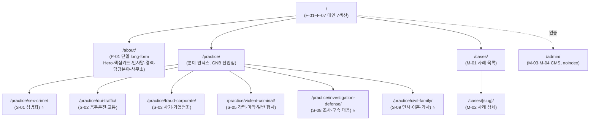

# 1차 정보 구조(IA) 제안 — 변호사 검토용 (옵션 D 임시안)

> 본 문서는 **류남경 변호사 인터뷰 전 단계**의 작업 가설(working draft)이다.
> 키워드 리서치 결과(`keyword-research-report.md`)에 정합하는 **옵션 D 6분야 안**을 임시 채택했다.
> 분야 구성·URL 슬러그·라벨은 모두 인터뷰 후 변경 가능하다.
>
> - 단일 진실 원천(SoT): `docs/02-expertise/scope-v1-contract.md`
> - 키워드 검색량 검증: `docs/02-expertise/keyword-research-report.md`
> - 공식 포지셔닝: `docs/03-firm/brand-positioning.md`
> - SEO 키워드 풀: `docs/02-expertise/seo-keywords.md`
> - 구조화 데이터 사양: `docs/02-expertise/structured-data-spec.md`
>
> 최종 업데이트: 2026-05-05

---

## 0. 한 장 요약 (변호사 보고용)

| 항목 | 내용 |
|------|------|
| 총 페이지 | **12개** (메인 1 + 인물 1 + 분야 6 + 사례 2 + CMS 2) |
| 분야 허브 수 | **6개** (옵션 D — 데이터 기반 슬림, 확정 안) |
| 메인 페이지 구성 *(예시 안)* | 7개 세로 섹션 (Hero · About 요약 · 분야 카드 · 신뢰지표 · 대표사례 · 상담절차 · 상담 CTA·약도) |
| 인물 페이지 | **`/about/` 단일 long-form** *(통합 확정)* — 섹션 구성 *(예시 안)*: Hero · 핵심카드 · 인사말 · 경력 타임라인 · 검사 시절 담당 분야 · 사무소·CTA |
| 분야 허브 | **6개** — 성범죄·음주운전·사기·강력·조사구속·민사이혼 |
| 성공사례 | 프론트 목록 + 상세 + CMS (`/cases/` · `/cases/[slug]/` + 어드민 2화면) |
| 결정 보류 | 인터뷰 후 — 분야 라벨 확정·블로그 시작 시점·후기 수집 |

> 이 한 장만 보면 변호사는 **"전체가 12개 페이지(분야 6개 포함)"** 를 이해할 수 있어야 한다.
>
> ✅ **확정 결정** (변경 시 SoT 재정정 필요): 분야 6개 단일 안 · About 통합 (P-01) · F-07 상담 폼 제거 → 전화 단일 채널.
> ⚠ **예시 안** (확정 아님): 메인 페이지 7섹션 구성 / About 단일 페이지의 6섹션 구성 / 모든 카피 — 변호사 검토·디자인 단계에서 변경 가능.

> ⚠ **계약상 페이지 수 영향**: 계약서 원본은 17단위(F-7+P-3+S-9+M-4)였다. 옵션 D + About 통합 채택 시 **12단위로 축소** → 갑/을 협의 안건.
>
> ⚠ **About 단일 페이지 결정 근거**: P-01·P-02·P-03 분리는 오버스펙. USP 키워드(검사출신 20·부부장 20·류남경 30 — 모두 ≤30/월)가 모두 검색량 작아 페이지 분리로 얻는 SEO 이득보다 권위 신호 분산 우려가 크다. 단일 long-form 안에 H2/H3로 키워드 분산 노출이 더 유리.

---

## 1. 글로벌 사이트맵



> 상담 진입은 **별도 `/contact/` 페이지 없이** 메인 F-07 섹션(`/#contact` 앵커) 한 곳으로 통합. 사이트 어디에서든 상담 CTA = 전화 010-7552-0301 단일 채널.

### 1-1. 표로 본 12개 단위

| 코드 | 페이지 | URL | 인덱싱 | 비고 |
|:---:|------|------|:---:|------|
| F-01~07 | 메인 (7섹션) | `/` | ✅ | 단일 페이지, 세로 7섹션 |
| **P-01** | **변호사 소개 (단일 long-form)** | `/about/` | ✅ | Hero · 핵심카드 · 인사말 · 경력 타임라인 · 검사 시절 담당 분야 · 사무소·CTA (P-02·P-03 통합) |
| **S-01** | 성범죄 | `/practice/sex-crime/` | ✅ | ⭐ 1순위 분야 (창원성범죄 350/월) |
| **S-02** | 음주운전·교통범죄 | `/practice/dui-traffic/` | ✅ | 음주·무면허·뺑소니·교특법 (창원음주운전 480/월) |
| **S-03** | 사기·기업범죄 | `/practice/fraud-corporate/` | ✅ | 일반사기·보이스피싱·전세사기 + **횡령·배임·조세·기술유출 H2** |
| **S-05** | 강력·마약·일반 형사 | `/practice/violent-criminal/` | ✅ | 살인·강도·마약·폭행·상해·절도 (마약전문 8,240/월 광역) |
| **S-08** | 조사·구속 대응 | `/practice/investigation-defense/` | ✅ | ⭐ 절차형 — 조사 동행·영장실질심사·압수수색·구속영장 |
| **S-09** | 민사·이혼·가사 | `/practice/civil-family/` | ✅ | ⭐ 이혼·재산분할·민사 명예훼손 손해배상 (창원이혼전문 2,700/월 — **6분야 중 검색량 최대**) |
| M-01 | 성공사례 목록 | `/cases/` | ✅ | 카드 그리드 + 분야 필터 (6개) |
| M-02 | 성공사례 상세 | `/cases/[slug]/` | ✅ | Article + Breadcrumb 스키마 |
| M-03 | CMS — 사례 CRUD | `/admin/cases/` | ❌ noindex | Payload 어드민 |
| M-04 | CMS — 분류·인증 | `/admin/categories/` 등 | ❌ noindex | Payload 어드민 |

> `/practice/` 는 12개 단위에 카운트되지 않는 **부속 페이지**(분야 6개 카드 인덱스).
>
> ⚠ **메인 섹션 메모**: 계약 원문 "메인 8섹션"이지만 변호사 결정으로 **언론·보도 섹션 제거 → 7섹션 운영**(SoT `scope-v1-contract.md` §0).
>
> ⚠ **삭제·강등된 분야 흔적** (옵션 D 채택 결과):
> - **S-04 횡령·배임·기업범죄** → S-03에 H2 통합 (창원 직접 검색 ≤20/월로 단독 격상 정당성 부재)
> - **S-06 일반 형사** → S-05에 통합 (#4 카니발리제이션 위험)
> - **S-07 명예훼손·모욕** → 분야 페이지 제거. 정보형 풀(68k/월)은 **블로그 콘텐츠**로 흡수, 민사 손해배상은 S-09 H2
>
> ⚠ **흡수된 P 페이지 흔적** (About 통합 결과):
> - **P-02 경력 타임라인** → P-01 §3 섹션으로 흡수
> - **P-03 인사말·사무소** → P-01 §2(인사말) + §5(사무소) 섹션으로 분리 흡수

---

## 2. 글로벌 네비게이션 (GNB / Footer)

### 2-1. GNB (헤더)

```
[로고]  변호사 소개  ┃  전문분야 ▾  ┃  성공사례  ┃  상담문의   ｜ ☎ 010-7552-0301
                       │
                       ├─ 성범죄 ⭐
                       ├─ 음주운전·교통범죄
                       ├─ 사기·기업범죄
                       ├─ 강력·마약·일반 형사
                       ├─ 조사·구속 대응 ⭐
                       └─ 민사·이혼·가사 ⭐
```

- **3개 진입점 + 1개 드롭다운** — 변호사 소개 / 전문분야(▾) / 성공사례
- **"상담문의" 메뉴 = 메인 페이지 F-07 섹션(`/#contact`) 앵커 링크** (별도 페이지 없음)
- **상담은 전화 단일 채널** — 우측 상단 ☎ 010-7552-0301 항상 노출(`tel:` 링크)
- **6개 드롭다운 → 모바일 UX 부담 완화** (옵션 A·B에서 9개 → 6개로 축소된 핵심 이점)

### 2-2. Footer (푸터)

```
법무법인 인유 창원사무소 [로고]      ┃  변호사 소개          ┃  전문분야            ┃  바로가기
                                   ├ 인물 소개            ├ 성범죄              ├ 성공사례
주소 / 전화 / 영업시간              ├ 경력 타임라인        ├ 음주운전·교통       ├ 상담문의
공식 블로그 링크                    └ 인사말·사무소        ├ 사기·기업범죄
                                                         ├ 강력·마약·일반 형사
사업자번호·대표변호사 표기                                  ├ 조사·구속 대응
                                                         └ 민사·이혼·가사
```

- 푸터는 **사이트맵 역할 + 변호사법상 의무표기** 충족
- 푸터 "상담문의" 항목도 메인 F-07 섹션(`/#contact`) 앵커로 점프
- 공식 블로그(blog.naver.com/inyou2025)는 푸터 외부 링크로 노출 (`rel="noopener"`)

---

## 3. 페이지별 섹션 블록

> ⚠ **본 절 §3-1(메인 페이지)·§3-2(About 페이지)의 구체적인 섹션 구성은 "예시 안"이다 — 확정 아님.**
> 섹션 수·순서·블록 단위·카피 모두 working draft이며, **변호사 검토 + 디자인 단계에서 변경 가능**.
> 확정된 것은 옵션 D §4의 **분야 6개 단일 안**과 §3-2 도입부의 **About 통합 결정**뿐이다.

### 3-1. F — 메인 페이지 `/` (단일 long-form) — **예시 안**

> ⚠ 아래 7섹션 구성은 한 가지 예시일 뿐. 변호사 피드백·디자인 시안에 따라 **섹션 추가·삭제·재배열·통합** 모두 가능.

| 코드 | 섹션 | 핵심 메시지 / 컴포넌트 | 1차 카피 출처 |
|:---:|------|----------------------|--------------|
| **F-01** Hero | 헤드라인 + 본인사진 + 전화 CTA | "19년 검사 경력으로 수사하고 증거를 찾아주는 변호사" + ☎ 010-7552-0301 | `brand-positioning.md` §2 |
| **F-02** About 요약 | "검사 19년·부부장 출신" 핵심 카드 → P-01 진입 | 4-up 카드: 19년 / 부부장 / 형사법 전문 / 검사·수사관팀 | `brand-positioning.md` §3 |
| **F-03** 분야 카드 | **6장** 카드 (S-01·S-02·S-03·S-05·S-08·S-09), 각 → 허브 | 분야명 + 1줄 요약 + "자세히 →" | `keyword-research-report.md` 옵션 D |
| **F-04** 신뢰지표 / Why us | 사법시험 44회 · 연수원 35기 · 19년 · 형사법 전문 등록 | 통계 카드 (4-up) | `brand-positioning.md` §3 |
| **F-05** 대표 성공사례 | M-01에서 가장 최근/대표 사례 3~4건 | 카드 미리보기 + "전체 사례 보기 →" | `04-cases/` (수집 예정) |
| **F-06** 상담 절차 | "수사기관을 대신하여 억울함을 풀어드립니다" 워크플로 | 4단계: 상담 접수 → 사실관계 분석 → 변론 전략 → 결과 보고 | 공식 카피 활용 |
| **F-07** 상담 CTA / 약도 / 푸터 | ☎ 010-7552-0301 + Kakao/Naver 약도 + 영업시간 + 푸터 | 큰 전화 버튼(`tel:`) + 지도 임베드 (폼 없음) | `brand-positioning.md` §1 |

> 7섹션 순서는 디자인 단계에서 재배열 가능.
> ⚠ **변경 사항**: 계약 원문은 8섹션이지만 변호사 결정으로 (1) **언론·보도 섹션 제거** → 7섹션, (2) **상담 폼 기능 제거** → 상담은 전화(010-7552-0301) 단일 채널.

### 3-2. P — 변호사 소개 단일 long-form (`/about/`) — 통합 결정 + **섹션 구성은 예시 안**

> ✅ **확정 결정**: P-01·P-02·P-03 분리 → P-01 단일 long-form 통합. (USP 키워드 4종 모두 ≤30/월로 페이지 분리 정당성 부족)
>
> ⚠ **아래 6섹션 구성(§0~§6)은 한 가지 예시일 뿐**: 섹션 수·순서·블록 단위·카피 모두 변호사 검토·디자인 단계에서 변경 가능. 확정된 것은 *"한 페이지에 통합한다"* 까지다.

#### P-01 `/about/` — 단일 long-form 구조 (예시 안)

| 섹션 | 블록 | 타깃 키워드 | 내용 |
|:---:|------|------|------|
| **§0** Hero (인물) | H1 | **#13 류남경 변호사 / #3 창원 검사출신 변호사** | 본인사진 + "대표변호사 류남경 — 검사 19년 부부장 출신" + 전화 CTA |
| **§1** 핵심 카드 4-up | — | (USP 신뢰지표) | 사법시험 44회 / 연수원 35기 / 검사 19년 / 형사법 전문 변호사 |
| **§2** 인사말 | H2 "인사말" | 공식 카피 USP | "수사기관을 대신하여 억울함을 풀어드립니다" 풀버전 ("수사하고 증거를 찾아주는 변호사") |
| **§3** 검사 19년 경력 타임라인 | H2 "검사 19년 — 광주지검부터 대구지검 부부장까지" | **#12 부부장검사 출신 변호사 / #11 경남 검사출신 변호사** | 학력·자격 (44회/35기/형사법 전문 등록) → 검사 재직 시계열 (2006~2024 광주·전주·창원·부산·대구지검) → **인사기사 인용** (검찰 인사 보도 캡처·링크) → 2024 변호사 개업 |
| **§4** 검사 시절 직접 담당 분야 | H2/H3 분야별 | 분야 USP 키워드 + 6개 S 허브 진입 | 성폭력전담합의부 공판(부산·창원) / 특수(조세·기술유출·다중피해) / 강력(살인·마약) / 기업범죄(횡령·배임). 각 카드 → 해당 S 허브 링크 |
| **§5** 사무소 | H2 "법무법인 인유 창원사무소" | (LocalBusiness 신호) | 경남 창원시 성산구 창이대로689번길 4-24, 5층 504호 + Naver/Kakao 약도 + 영업시간(평일 09:00~18:00) + 공식 블로그 외부 링크 |
| **§6** CTA | — | — | 큰 전화 버튼 ☎ 010-7552-0301 (`tel:` 링크) |

> **분리에서 통합으로 바뀐 결정 근거**:
> - 검사출신 20·부부장 20·류남경 30 — USP 키워드 모두 검색량 낮음 → 페이지 분리로 얻는 SEO 이득 부족
> - 단일 long-form 안에 H2/H3로 키워드를 자연스럽게 분산 노출하는 것이 권위 신호 집중·내부 링크 효율 모두 우월
> - 콘텐츠 공수 절감(P 영역 ~30~40% 단축)·운영 부담 감소
>
> 향후 트래픽 검증 후 특정 섹션(예: 경력 타임라인)이 독립적인 SEO 가치를 입증하면 **2차에 분리 가능**. 1차에는 통합.

### 3-3. S — 전문분야 허브 (6페이지)

> §4 에서 6분야 옵션 D 임시안 확정. 본 절은 **모든 허브에 공통되는 페이지 내부 블록 패턴**만 정의.

#### 분야 허브 1페이지 공통 블록 패턴

| 블록 | 내용 |
|------|------|
| Hero | "창원 [분야] 변호사 — 검사 19년 출신 류남경" + 전화 CTA(☎ 010-7552-0301) |
| 분야 개요 | 무엇이 [분야]인지 / 왜 검사 출신이 강한지 (200~300자) |
| 세부 혐의 (H2/H3) | 분야 안의 세부 혐의 4~6개를 H2/H3로 통합 |
| 검사 시절 경험 카드 | 해당 분야의 본인 직접 담당 경험 |
| 대응 프로세스 | 사건 단계별 변호사 대응 (수사 단계 → 공판 → 항소) |
| 관련 성공사례 | M-01에서 분야 태그 매칭 사례 3건 미리보기 |
| FAQ (선택, 1~3개) | 자주 묻는 질문 (FAQPage 스키마는 1차 미적용) |
| CTA | 상담문의 ☎ 010-7552-0301 (`tel:` 링크) |

> 6개 허브 모두 위 패턴을 따른다. **단**:
> - **S-08 (조사·구속 대응)** 은 절차형 페이지라 "세부 혐의" 대신 "사건 단계별 대응"(체포·조사 통보 → 출석 동행 → 영장실질심사 → 구속·불구속 결정)으로 H2 구성
> - **S-09 (민사·이혼·가사)** 는 USP 무력화 우려 대응 카피 필요 — "검사 19년 출신이 직접 변론하는 가사·민사 분쟁" 톤으로 형사 USP를 transfer
> - **S-03 (사기·기업범죄)** 는 일반사기 H2 + 횡령·배임·조세·기술유출 H2를 **2단 그룹화**해 메타 주제 분산을 피한다 (옛 S-04의 메타 분산 우려 해소)

### 3-4. M — 성공사례 (4단위)

#### M-01 `/cases/` — 목록

| 블록 | 내용 |
|------|------|
| 페이지 헤더 | "성공사례 — 검사 19년 출신 류남경 변호사가 직접 변론한 기록" |
| 분야 필터 | S-01·S-02·S-03·S-05·S-08·S-09 6개 카테고리 + "전체" 토글 |
| 사례 카드 그리드 | 제목 / 분야 / 결과 1줄 / 게시일 |
| 페이지네이션 | 12건/페이지 |

> ⚠ **빈 분야 필터 처리** (Thin Content 방어): 사례 0건인 분야는 필터 버튼 자동 비활성, 건수 배지("성범죄 (3)") 노출.

#### M-02 `/cases/[slug]/` — 상세

| 블록 | 내용 |
|------|------|
| Breadcrumb | 홈 > 성공사례 > [분야] > [사건명] |
| 사건 개요 | 의뢰 시점, 혐의, 핵심 쟁점 |
| 변론 전략 | 검사 출신 시각으로 본 대응 포인트 |
| 결과 | 결과 요약 (무죄·기소유예·벌금 감경 등) |
| 의뢰인 후기 | (선택) 1차에는 비활성, 수집 후 활성화 |
| 관련 사례 | 같은 분야 다른 사례 3건 |
| CTA | "유사 사건 상담" → ☎ 010-7552-0301 (`tel:` 링크) |

> JSON-LD: `Article` + `BreadcrumbList`. `author`는 류남경 변호사 본인.

#### M-03 `/admin/cases/` — CMS (사례 CRUD)

| 기능 | 상세 |
|------|------|
| 인증 | Payload 기본 인증 (대표변호사 + 사무직원) |
| 사례 목록 | 게시/숨김 토글, 분야 필터 |
| 사례 작성/편집 | 제목, 분야, 사건 개요, 결과, 게시일, 대표 이미지 |
| 게시 즉시 반영 | on-demand revalidation (`revalidatePath` 훅) |

#### M-04 `/admin/categories/` 등 — CMS (분류·인증)

| 기능 | 상세 |
|------|------|
| 카테고리 관리 | S-01·S-02·S-03·S-05·S-08·S-09 매핑 |
| 사용자 관리 | 어드민 사용자 추가/삭제 |
| 메타 관리 | 메인·허브 페이지 메타 텍스트 수정 |

> M-03/M-04 모두 `<meta name="robots" content="noindex, nofollow">` 강제.

---

## 4. 분야(practiceArea) 6분야 구성 — 옵션 D 임시안

> 결정 근거: `keyword-research-report.md`의 1,212개 unique 키워드 검색량 데이터(2026-05-05).

### 4-1. 6분야 구성

| 코드 | 분야 | URL | 격상 정당성 (실측 검색량) | H2/H3 통합 세부 혐의 |
|:---:|------|-----|--------------------------|----------------------|
| **S-01** | **성범죄** ⭐ | `/practice/sex-crime/` | 창원성범죄 350 + 강제추행 150 (#1·#2·#5) | 강제추행·준강간·유사강간·카메라등이용촬영·통신매체이용음란·아청법·디지털성범죄(불법촬영·딥페이크)·성희롱·성매매 |
| **S-02** | **음주운전·교통범죄** | `/practice/dui-traffic/` | 창원음주운전 480 (#6) | 음주운전·무면허·윤창호법·위드마크·측정거부·뺑소니(도주치상)·교통사고특례법 |
| **S-03** | **사기·기업범죄** | `/practice/fraud-corporate/` | 창원사기 130 (#7) | 일반사기·차용금사기·전세사기·보이스피싱·투자사기·코인사기 + **업무상 횡령·업무상 배임·특경가법·조세포탈·기술유출·영업비밀·공정거래·회계부정** (옛 S-04 흡수) |
| **S-05** | **강력·마약·일반 형사** | `/practice/violent-criminal/` | 광역 — 마약전문 8,240 / 일반형사 12,690 (창원 매칭은 작음) | 살인·살인미수·강도·특수강도·특수상해·특수폭행·특수협박·조직폭력·폭력행위등·마약(투약·밀수·필로폰·대마)·폭행·상해·절도·공무집행방해·업무방해·재물손괴·도박 (옛 S-06 통합) |
| **S-08** | **조사·구속 대응** ⭐ | `/practice/investigation-defense/` | USP 정합 최강 (검색량 작아도 전환율 압도적) | 검찰·경찰 조사 동행·피의자 신문 입회·변호인 참여권·진술거부권·압수수색 대응·영장실질심사·구속영장·체포적부심·고소대리·고발대리 |
| **S-09** | **민사·이혼·가사** ⭐ | `/practice/civil-family/` | **창원이혼전문 2,700 + 창원이혼 510** — 6분야 중 검색량 최대 | 이혼(협의·재판상)·재산분할·위자료·**민사 명예훼손·손해배상**·상속·유류분·일반 민사(임대차·차용금 회수) |

### 4-2. SEO 키워드 매핑 (1차 13건 + 절차형 + 옵션 D 신규)

| 순위 | 키워드 | 실측 월 검색량 | 매핑 | 비고 |
|:---:|--------|--:|------|------|
| 1 | 창원 성범죄 변호사 | 350 | **S-01 단독** | 1순위 분야 |
| 2 | 창원 성폭력 변호사 | 20 | S-01 본문 동의어 | 동의어, 같은 페이지 |
| 3 | 창원 검사출신 변호사 | 20 | F + P-01 | USP — 모든 허브 Hero·메타 |
| 4 | 창원 형사전문변호사 | **1,100** | F + 모든 S H1 보조 | 1차 13개 중 검색량 최대 |
| 5 | 창원 강제추행 변호사 | 150 | S-01 H2 | 별도 페이지 X |
| 6 | 창원 음주운전 변호사 | 480 | **S-02 단독** | 격상 |
| 7 | 창원 사기 변호사 | 130 | **S-03 단독** | 격상 |
| 8 | 창원 조세 변호사 | 20 | S-03 H2 | 옛 S-04 흡수 |
| 9 | 창원 기술유출 변호사 | 20 | S-03 H2 | 옛 S-04 흡수 |
| 10 | 창원 횡령 배임 변호사 | 20 | S-03 H2 | **단독 격상 X** (검색량 미달, 옛 S-04에서 강등) |
| 11 | 경남 검사출신 변호사 | 20 | F + P-01 | 광역 USP |
| 12 | 부부장검사 출신 변호사 | 20 | P-01 §3 (경력 H2) | USP, 경쟁 낮음 |
| 13 | 류남경 변호사 (브랜드) | 30 | F + P-01 §0 (Hero H1) | 검사 시절 검색 흡수 |
| (보조) | 검찰조사 변호인 | 20 | **S-08 단독** | 절차형 — 전환율 최강 |
| (보조) | 영장실질심사 변호사 | 30 | **S-08 단독** | 절차형 |
| (보조) | 압수수색 대응 | 20 | **S-08 단독** | 절차형 |
| (신규) | **창원 이혼 전문변호사** | **2,700** | **S-09 단독** ⭐ | 6분야 최대 검색량 |
| (신규) | 창원 이혼 변호사 | 510 | S-09 H2 | 동의어 |
| (이관) | 창원 명예훼손 변호사 | 20 | **블로그 + S-09 H2** (민사 손배) | 분야 페이지 격상 X |

> **단독 페이지 격상 키워드 6개 — S-01·S-02·S-03·S-05·S-08·S-09** + 브랜드/USP는 F·P 횡단 노출.

### 4-3. "검사 19년" USP 보존 전략

**"검사 19년" 메시지는 다음 위치에서 일관 노출**한다.

| 노출 위치 | 카피 |
|----------|------|
| 모든 허브 Hero (S-01·S-02·S-03·S-05·S-08·S-09) | "창원 [분야] 변호사 — 검사 19년 출신 류남경" |
| 모든 허브 분야 개요 (200~300자) | "검사 19년 경험으로 본 [분야] 사건의 핵심 쟁점" |
| 각 허브의 "검사 시절 경험 카드" 블록 | 본인 직접 담당 경험 |
| 메타 description | "검사 19년 출신 류남경 변호사가 직접 변론" |
| 메인 F-04 신뢰지표 | 19년·44회·35기·형사법 전문 등록 4-up |
| **P-01 §3 경력 타임라인** | "광주지검부터 대구지검 부부장까지 검사 19년" + 인사기사 인용 |
| 특히 **S-08 (조사·구속 대응)** | "조사하던 검사가 조사받는 분의 편에 섭니다" 강한 카피 |
| 특히 **S-09 (민사·이혼·가사)** | "검사 19년 출신이 직접 변론하는 가사·민사 분쟁" — USP transfer |

### 4-4. 6분야의 형사·민사 균형

- **5분야(S-01·S-02·S-03·S-05·S-08)는 형사** — 첫인상에서 "검사 출신 형사 전문" 명확
- **S-09(민사·이혼·가사)** 는 검색량이 6분야 중 최대(창원이혼전문 2,700/월) — *의도적으로 마지막 슬롯*에 두되 카드·페이지 디자인은 동등하게 처리
  - F-03 메인 카드에서도 노출 (옵션 A·B의 "F-03 제외" 권장과 반대 결정 — 검색량 데이터 정합)
  - 페이지 안에 USP transfer 카피 + "본 사안의 핵심이 형사이면 → S-01~S-08 / 민사·가사 청구가 필요하면 → 본 페이지" 분기 안내
- GNB 드롭다운 순서: 성범죄 → 음주 → 사기·기업 → 강력·일반 → 조사·구속 → 민사·이혼

---

## 5. 옵션 A·B·C 대비 우려 해소 (요약)

`keyword-research-report.md` §4 우려 #1~#6 검증 결과를 옵션 D가 어떻게 해소하는지:

| 우려 | 옵션 D 처분 |
|------|-------------|
| **#1** S-06 카니발리제이션 | S-05에 통합 → 해소 |
| **#2** S-07 헤드 부재 | 분야 페이지 제거 + 블로그로 이관 → 해소 |
| **#3** S-09 USP 무력화 + SEO 효율 낮음 | **반박** — 데이터 검증으로 SEO 효율 1위 확인. USP는 카피로 transfer |
| **#4** S-04 메타 주제 분산 | S-03에 H2 통합 → 해소 |
| **#5** Thin Content 위험 | 인터뷰에서 "분야별 직접 담당 사건 1~2건" 수집 (필수 안건) |
| **#6** 검색량 검증 미완 | 본 보고서로 해소 (1,212 unique 키워드 데이터 확보) |

---

## 6. 현실성·개발 공수 메모

> 이전 `ia-v1-feedback.md` §2 흡수.

### 6-1. 계약 범위 영향 — 갑/을 협의 필수
- 계약서 원문: *"S-01 ~ S-N (갑 제안에 따른다)"* 이므로 6분야 자체는 합법. About 단일 페이지도 갑 제안 가능 범위.
- 다만 **17 → 12단위 (-29%)** 변경 → 페이지 단가/일정 협의가 인터뷰 안건.

### 6-2. 컴포넌트 공수는 미미, 콘텐츠 공수는 -33%
- 블록 패턴이 동일 → React 컴포넌트 1세트로 6분야 커버. 코드 측 공수 영향 미미.
- **콘텐츠 공수**: 9분야 → 6분야로 변호사 시간 ~33% 절감 (Hero·개요·세부 혐의·검사 시절 경험·대응 프로세스 작성).

### 6-3. GNB 6개 드롭다운 — 모바일 UX 부담 완화
- 9분야 → 6분야로 모바일 햄버거 클릭 깊이 감소.
- 모바일에서도 핵심 6개 모두 노출 가능 (옵션 B의 "5개 + 더보기 토글" 불필요).

### 6-4. 사례 필터 6개
- 9개 → 6개로 빈 필터 위험 감소. 그래도 1차 출시 시점에는 사례 누적 단계라:
  - 분야 필터에 건수 배지("성범죄 (3)") 노출
  - 0건 분야 자동 비활성

### 6-5. Payload enum 변경의 비가역성
- `payload-types.ts` 카테고리 enum이 6분야로 확정되면 향후 변경 시 사례 데이터 마이그레이션 비용 큼.
- **인터뷰 후 단 한 번만** 변경하는 규율 필요. 인터뷰 시 변호사에게 **"분야 라벨이 1년 후 바뀔 가능성"** 을 미리 묻는 게 안전.

---

## 7. 인터뷰 시 변호사에게 받을 결정 항목

| # | 결정 항목 | 옵션 | 결과 영향 |
|---|----------|------|----------|
| 1 | **6분야 구성 확정** | 옵션 D 6분야 채택 / 일부 조정 / 옵션 A·B·C 회귀 | 최종 IA |
| 2 | **분야별 직접 담당 사건 1~2건** (Thin Content 방어 핵심) | 분야당 사건 사례 제공 | 모든 S 페이지의 "검사 시절 경험 카드" 콘텐츠 |
| 3 | **분야 라벨 변경 가능성** | "사기·기업범죄" vs "사기" / "강력·마약·일반 형사" 라벨 단순화 등 | Payload enum 마이그레이션 비용 |
| 4 | **S-09 (민사·이혼·가사) 처리 의향** | 검색량 1위지만 형사 USP 일관성을 위해 명시적 후순위로? | F-03 카드 위치, 페이지 톤 |
| 5 | **S-05 마약 광역 페이지 분리 가능성** | 마약 일반 8,240/월 → 별도 `/practice/drug/` 페이지? | 6 → 7분야 가능성 |
| 6 | 성공사례 — 프론트 분리 vs 통합 | A: 목록+상세 분리 / B: 단일 expandable | M-02 존재 여부 |
| 7 | 사무소 좌표·약도 임베드 | Naver / Kakao / Google | F-07, P-01 §5 |
| 8 | 사무소 유선전화 공개 여부 | 공개 / 010만 공개 | F-07 푸터 |
| 9 | 본인 사진 / 팀 사진 보유 여부 | 있음·없음·촬영 필요 | F-01 Hero, P-01 §0 Hero |
| 10 | 후기 수집 의향 | Yes (1차 비활성, 향후 활성) / No | M-02 향후 확장 |
| 11 | 영업시간 | 평일 09~18 등 | F-07, P-01 §5 |
| 12 | S-08 (조사·구속) 단가/서비스 형태 | 시간당 동행료 / 사건 단위 / 무료 1회 진단 | S-08 페이지 가격 안내 |
| 13 | **블로그 시작 시점** (옛 S-07 명예훼손 콘텐츠 흡수용) | 1차 출시와 동시 / 트래픽 검증 후 | 블로그 시스템 구축 일정 |
| 14 | 모바일 GNB UX 변호사 선호 | 6개 모두 노출 vs 핵심 + 더보기 | 모바일 헤더 디자인 |
| 15 | 계약상 페이지 단가/일정 영향 (17 → 12단위) | 단가 재산정 / 그대로 / 일정 단축 | 계약 재협의 명문화 |

> ⚠ **결정 완료된 항목 (제거)**: 옛 #6 "About 그룹 분리 유지" → **단일 long-form 통합으로 결정**, P-01 단일 페이지 채택 (§0 결정 근거 참조).

---

## 8. 다음 단계

1. **본 문서 변호사 검토** — 옵션 D 6분야 + About 단일 페이지 임시안 + 결정 항목 15개 답변 수집
2. **인터뷰 결과 SoT 반영** — `scope-v1-contract.md` §2·§3·§5·§8 정정
3. **`payload-types.ts` 카테고리 enum 확정** — 결정된 분야 수로 단 한 번 마이그레이션
4. **F/P/S/M 페이지 스켈레톤 구축 시작** — IA 확정 직후 착수
